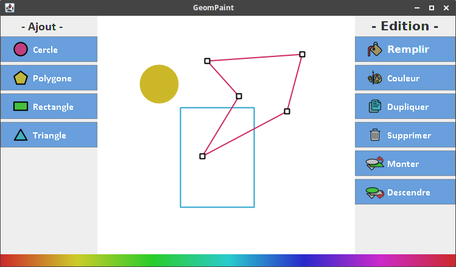

# GeomPaint

Projet scolaire - Logiciel de dessin vectoriel

## Description

Geompaint permet de dessiner des figures géométriques telles que le triangle, le cercle le rectangle et un polygone quelconque.
Il permet également de les copier, les modifier, les supprimer, les colorier et les déplacer.
Egalement, le déplacement vers l'avant et vers l'arrière de la fenêtre est possible afin de pouvoir déplacer les figures librement.
Des raccourcis claviers ont été ajoutés pour rendre le logiciel plus intuitif et plus ergonomique :

## Utilisation

Une barre de couleur est disponible pour choisir aisément la couleur de la figure et son contour.
Le clic droit de la souris permet de remplir la figure, le clic du milieu permet de colorier le contour. 
Il est possible de choisir la couleur du contour plus précisément avec le bouton Couleur. Attention, ce bouton ne permet pas de choisir la couleur du fond.
Seule la barre de couleurs en bas le permet. 
 
## Raccourcis clavier

* Shift + V pour dupliquer,
* Suppr pour supprimer une figure,
* Shift + T pour créer un triangle,
* Shift + C pour créer un cercle,
* Shift + R pour créer un rectangle,
* Shift + P pour créer un polygone,
* F pour remplir une figure,
* PageUp pour monter la figure,
* PageDown pour descendre la figure,
* Entrée pour valider une figure,
* Echap pour annuler la création d'une figure
 
# Auteurs

* Élise Moreau
* Loic Spacher
* François de Blic
